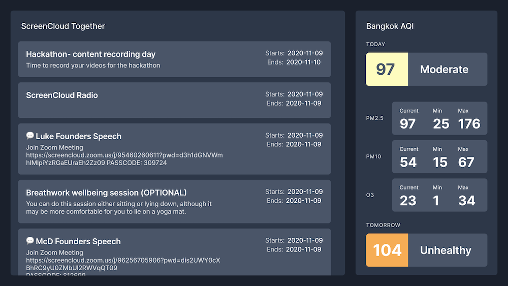
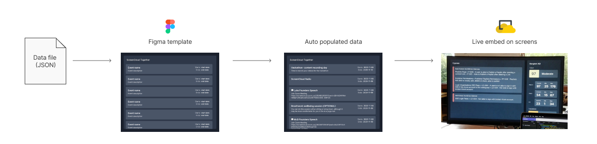

# Creating Company TV using Figma + a data pipeline

Luke once described ScreenCloud as a way to manage all the content on all your screens.

To us, this means that people should be able to use the tools that they’re familiar with and love to use with ScreenCloud.

For our hackathon project, we set out to see if we could make Company TV using external tools and plug them into ScreenCloud.

The answer is yes, with an asterisk. There are lots of creative things we can do, but they require some fiddling

([Loom demo](https://www.loom.com/share/c18dfc9e58bc4162a058e21509b9fece))

**End Result:**

## The tech stack

The hack uses a data pipeline, Figma, and ScreenCloud API.

### Figma

We used Figma because it is a very popular design tool, and has a very robust plugin system. This means we can make on-brand templates, link a data pipeline (GraphQL, JSON files, etc), and output live embeds on our screens.

Because all the design is managed in Figma, users have total control over the look and feel. And when they need to, they can change the design (fonts, colors, layout, etc), and all the content will magically update.

For retrieving data, we use [JSON to Figma](https://www.figma.com/community/plugin/789839703871161985/JSON-to-Figma). With this plugin, we can input a JSON file (ie. Calendar events for ScreenCloud Together) into our calendar template.

**Note:** Currently, plugins have to be run manually, meanings constant updates aren’t possible. Running plugins automatically will likely be possible in the future, but in the meantime, we think we can fork the plugin to loop and run forever — a hack for getting constant updates.

For displaying on screens, we use a live embed of each frame. This is amazing because changes are instantly reflected on all screens.

**Note:** Because of the iframe limitation on ScreenCloud Player, we wrap the embeds in HTML files, hosted on GitHub Pages, with a little styling to hide Figma UI. The output HTML file is then added to ScreenCloud using the Links feature.

### ScreenCloud API

We can also take advantage of the ScreenCloud API to conditionally change content. Instead of time-based looping content, we can show certain content when we need to.

**Example:** 
- Show regular content on screen
- Automatically switch to an error dashboard when there’s a new error. 
- After the error has been fixed, we can switch back.

## Resources
- [Code samples & example files](https://github.com/steakscience/screencloud-figma-hack/tree/main/resources)
- [Loom demo](https://www.loom.com/share/c18dfc9e58bc4162a058e21509b9fece)

***

**Team:**
- Title Plinsut ([@varshard](https://github.com/varshard))
- Michal Mikolajczyk ([@michalscreen](https://github.com/michalscreen))
- Golf Positwinyu ([@restingisimportant](https://github.com/restingisimportant))
- Dogan Yazar ([@doganyazar](https://github.com/doganyazar))
- Nirawit Jittipairoj ([@steakscience](https://github.com/steakscience))
